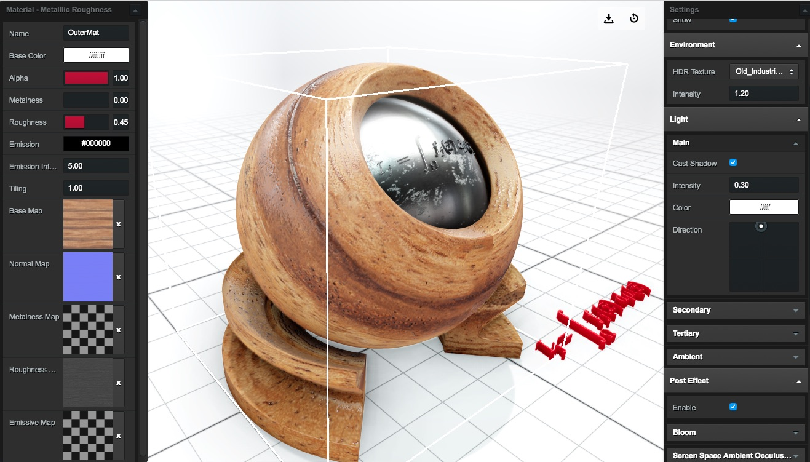

# Clay Viewer

3D [glTF2.0](https://github.com/KhronosGroup/glTF) model viewer with high quality rendering based on [ClayGL](https://github.com/pissang/claygl)

## Editor

<a href="https://pissang.github.io/clay-viewer/editor/">
    
</a>

## App

[Download App](https://github.com/pissang/clay-viewer/releases/) on Windows and macOS with FBX/DAE/OBj import. Use it as a common model preview tool!

## Loader

```js
var viewer = new QMV.Viewer(document.getElementById('main'), {
    // Full config at
    // https://github.com/pissang/clay-viewer/blob/master/src/defaultSceneConfig.js
    devicePixelRatio: 1,
    // Enable shadow
    shadow: true,
    shadowQuality: 'high',
    // Environment panorama texture url.
    environment: 'env.jpg',
    mainLight: {
        intensity: 2.0
    },
    ambientCubemapLight: {
        exposure: 1,
        diffuseIntensity: 0.2,
        texture: 'asset/texture/example1.jpg'
    },
    postEffect: {
        // Enable post effect
        enable: true,
        bloom: {
            // Enable bloom
            enable: true
        },
        screenSpaceAmbientOcculusion: {
            // Enable screen space ambient occulusion
            enable: true
        }
    }
});

// Load a glTF model
// Model will be fit in 10x10x10 automatically after load.
// Return an eventful object.
viewer.loadModel('asset/xiniu/xiniu_walk_as.gltf', {
        // Shading mode. 'standard'|'lambert'
        shader: 'standard'
    })
    // Model loaded. not include textures.
    .on('loadmodel', function (modelStat) {
        // Set camera options.
        viewer.setCameraControl({
            // Alpha is rotation from bottom to up.
            alpha: 10,
            // Beta is rotation from left to right.
            beta: 30,
            distance: 20,
            // Min distance of zoom.
            minDistance: 1,
            // Max distance of zoom.
            maxDistance: 100,

            // Center of target.
            center: [0, 0, 0],

            // If auto rotate.
            autoRotate: false,

            // Degree per second.
            autoRotateSpeed: 60,

            // Direction of autoRotate. cw or ccw when looking top down.
            autoRotateDirection: 'cw',

            // Start auto rotating after still for the given time
            autoRotateAfterStill: 30
        });

        // Set main light options.
        viewer.setMainLight({
            // Main light intensity
            intensity: 1,
            // Main light color string
            color: '#fff',
            // Alpha is rotation from bottom to up.
            alpha: 45,
            // Beta is rotation from left to right.
            beta: 45
        });
        // Set ambient light options
        viewer.setAmbientLight({
            // Ambient light intensity
            intensity: 0.8
        });

        viewer.start();

        // Load extra animation glTF
        viewer.loadAnimation('asset/xiniu/xiniu_stand_as.gltf')
            .on('success', function () {
                console.log('Changed animation')
            });
        // Animation pause and start
        viewer.pauseAnimation();
        viewer.resumeAnimation();

        // Print model stat.
        console.log('Model loaded:');
        console.log('三角面：', modelStat.triangleCount);
        console.log('顶点：', modelStat.vertexCount);
        console.log('场景节点：', modelStat.nodeCount);
        console.log('Mesh：', modelStat.meshCount);
        console.log('材质：', modelStat.materialCount);
        console.log('纹理：', modelStat.textureCount);
    })
    .on('ready', function () {
        console.log('All loaded inlcuding textures.');
    })
    .on('error', function () {
        console.log('Model load error');
    });

```

[Here](https://github.com/pissang/clay-viewer/blob/master/src/defaultSceneConfig.js) is the full graphic configuration

## Converter

ClayGL provide a python tool for converting FBX to glTF 2.0.

https://github.com/pissang/claygl/blob/master/tools/fbx2gltf.py

Needs [python3.3](https://www.python.org/download/releases/3.3.0/) and [FBX SDK 2018.1.1](http://usa.autodesk.com/adsk/servlet/pc/item?siteID=123112&id=26416130)

```
usage: fbx2gltf.py [-h] [-e EXCLUDE] [-t TIMERANGE] [-o OUTPUT]
                    [-f FRAMERATE] [-p POSE] [-q] [-b]
                    file

FBX to glTF converter

positional arguments:
  file

optional arguments:
  -h, --help            show this help message and exit
  -e EXCLUDE, --exclude EXCLUDE
                        Data excluded. Can be: scene,animation
  -t TIMERANGE, --timerange TIMERANGE
                        Export animation time, in format
                        'startSecond,endSecond'
  -o OUTPUT, --output OUTPUT
                        Ouput glTF file path
  -f FRAMERATE, --framerate FRAMERATE
                        Animation frame per second
  -p POSE, --pose POSE  Start pose time
  -q, --quantize        Quantize accessors with WEB3D_quantized_attributes
                        extension
  -b, --binary          Export glTF-binary
  --beautify            Beautify json output.
  --noflipv             If not flip v in texcoord.
```


## Seperate scene and animation

Export scene

```bash
# exclude animation
fbx2gltf2.py -e animation -p 0 xxx.fbx
```

Export animation

```bash
# exclude scene, 0 to 20 second, 20 framerate.
fbx2gltf2.py -e scene -t 0,20 -f 20 -o xxx_ani.gltf xxx.fbx
```

Load scene and animation asynchronously

```js
viewer.loadModel('asset/xiniu/xiniu.gltf')
    // Model loaded. not include textures.
    .on('loadmodel', function (modelStat) {
        viewer.start();
        // Load extra animation glTF
        viewer.loadAnimation('asset/xiniu/xiniu_ani.gltf');
    });
```

## Build

```bash
npm install
# Build loader
npm run build
# Build editor
webpack --config editor/webpack.config.js
```